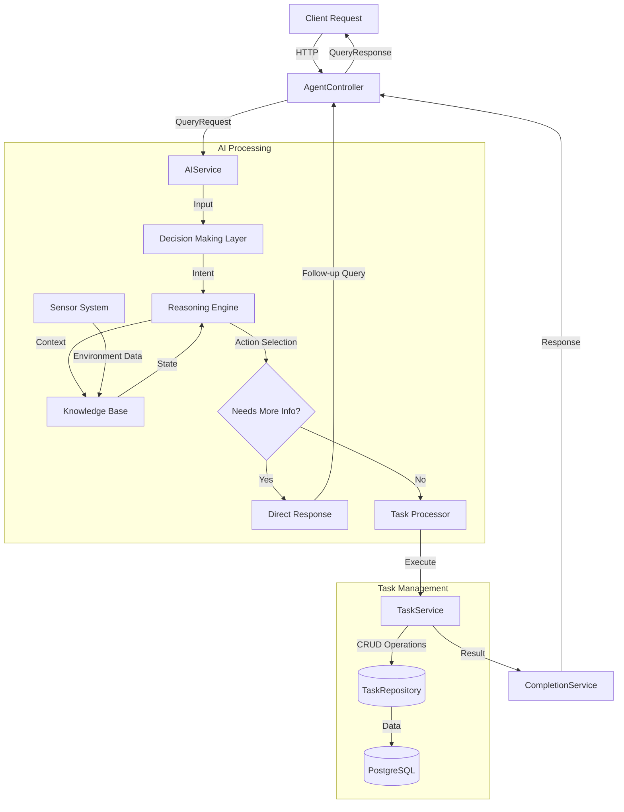

# AI Task Assistant Backend
[](https://github.com/$GITHUB_USERNAME/agent/actions/workflows/maven.yml)
[](../../backend/target/site/jacoco/)
[](../../backend/target/site/jacoco/)

Spring Boot backend implementing an AI agent for natural language task management.

## Features
- Process natural language requests to create, complete, and list tasks
- Store tasks in a PostgreSQL database using Spring Data JDBC
- RESTful API for direct task management
- Utilizes GPT-4o model for advanced language understanding
- Implements various AI agent patterns for sophisticated task handling

## Requirements
- Java 21
- Maven
- Docker and Docker Compose (for PostgreSQL)
- OpenAI API key

## Getting Started

### 1. Start the PostgreSQL database
```bash
docker-compose up -d
```

### 2. Set your OpenAI API key as an environment variable
```bash
export OPENAI_API_KEY=your-api-key-here
```

### 3. Build and run the application
```bash
mvn spring-boot:run
```

## API Documentation

### Natural Language Processing
```
POST /api/query
Content-Type: application/json

{
  "query": "Add a new task to buy groceries",
  "context": {} // Optional context for updates or follow-ups
}

Response:
{
  "response": "Task created successfully: Buy groceries",
  "requiresFollowUp": false,
  "context": null,
  "resultTask": {
    "id": 1,
    "description": "Buy groceries",
    "completed": false,
    // ...other task fields
  }
}
```

### Task Management API

#### List Tasks
- `GET /api/tasks` - List all tasks
- `GET /api/tasks/active` - List only incomplete tasks
- `GET /api/tasks/root` - List top-level tasks (no parent)
- `GET /api/tasks/{id}/subtasks` - List subtasks of a specific task
- `GET /api/tasks/priority/{priority}` - List tasks by priority
- `GET /api/tasks/overdue` - List overdue incomplete tasks

#### Create and Update Tasks
- `POST /api/tasks` - Create a new task
  ```json
  {
    "description": "Task description",
    "deadline": "2025-04-01T10:00:00",
    "priority": "HIGH",
    "constraints": "Must be completed before the meeting",
    "parentId": null,
    "metadata": {}
  }
  ```

- `PUT /api/tasks/{id}` - Update an existing task
  ```json
  {
    "description": "Updated description",
    "deadline": "2025-04-01T10:00:00",
    "priority": "HIGH",
    "constraints": "Updated constraints"
  }
  ```

- `PUT /api/tasks/{id}/complete` - Mark a task as complete

## Implementation Details

### Key Components
- Task Actions: CreateTaskAction, CompleteTaskAction, ListTasksAction
- Decision Making: OpenAIDecisionMaker for intent classification
- Data Model: Immutable Task records with Spring Data JDBC
- Configuration: Environment-based settings and CORS setup

### Code Organization
- `config/` - Spring configuration including AI and database setup
- `controller/` - REST API endpoints
- `model/` - Data models and domain objects
- `repository/` - Data access layer
- `service/` - Business logic and AI integration
  - `decision/` - Intent classification and decision making
  - `knowledge/` - State and context management
  - `reasoning/` - Chain of thought implementation
  - `sensor/` - Environment data collection
  - `task/` - Task action implementations

## System Architecture
The following diagram illustrates the flow of data and control through the system's components:



### Component Descriptions
- **Controller Layer**: Handles HTTP requests and response formatting
- **AI Processing**:
  - Decision Making: Analyzes user intent using OpenAI
  - Reasoning Engine: Implements chain-of-thought processing with early exit for incomplete information
  - Knowledge Base: Maintains system state and context
  - Sensor System: Gathers environmental data
- **Task Management**:
  - Task Processor: Executes determined actions
  - Task Service: Handles business logic