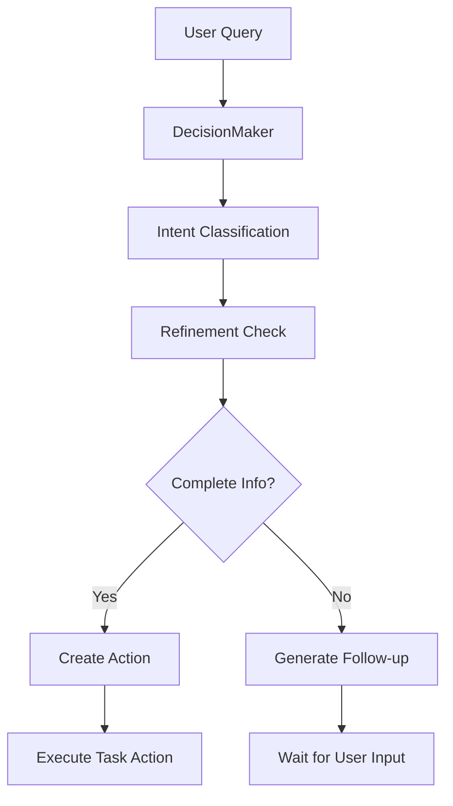

# Current Architecture

## Component Behaviors

### 1. AI Integration (Spring AI)
- Uses Spring AI's ChatClient directly
- Configuration in AIConfig.java
- Simple builder pattern for client creation
```java
@Bean
public ChatClient chatClient(ChatClient.Builder builder) {
    return builder.build();
}
```

### 2. Decision Making Components

#### DecisionMaker
- Uses Spring AI ChatClient for intent classification
- Supports basic intents: CREATE_TASK, COMPLETE_TASK, LIST_TASKS
- Internal record for intent classification:
```java
private record IntentClassification(String intent) {}
```

#### Intent Classification Process
1. Receives query and context as Map<String, Object>
2. Uses direct prompt for classification
3. Prompt focuses on task management intents
4. Returns structured IntentClassification

#### Refinement (In Progress)
- Current implementation handles basic task refinement
- Uses ConversationContext for state management
- Supports multi-turn conversations for task details
- Handles:
  - Task description
  - Deadlines
  - Priorities
  - Constraints

### 3. Task Management

#### TaskParameters
- Current implementation is mutable
- Supports:
  - Description
  - Deadline
  - Priority
  - Constraints
  - Parent ID

#### ActionDecision
- Record type with:
  - TaskAction
  - TaskParameters
  - Next prompt
  - Context

### 4. Conversation Flow



## Current State of Refinement Pattern

### Status
- In Progress (Started: 2025-03-26)
- Enhancing simple command parsing to intelligent refinement

### Current Capabilities
1. Basic intent classification
2. Simple parameter extraction
3. Follow-up question generation
4. Context preservation between turns

### Implementation Details
1. Uses Spring AI's ChatClient directly
2. Maintains conversation state in ConversationContext
3. Supports basic task parameters
4. Handles incomplete information through follow-ups

### Test Coverage
Current test cases focus on:
1. Basic intent classification
2. Context preservation
3. Parameter extraction
4. Error handling

## Planned Enhancements
(From refinement-pattern.md)
1. Enhanced task metadata
2. Subtask relationships
3. Improved conversation handling
4. Better prompt engineering
5. Async conversation support