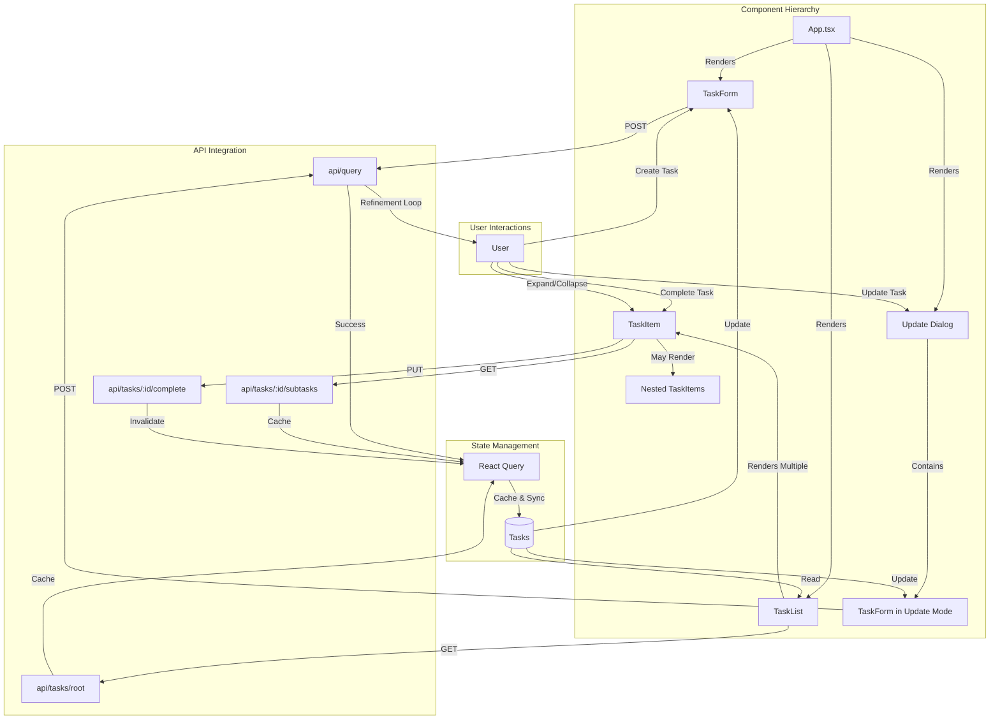

# Task Manager Frontend

A React-based frontend for the AI Task Management system, built with TypeScript, Vite, and Material-UI.

## Getting Started

### Prerequisites
- Node.js
- npm/yarn
- Backend server running (see backend README)

### Installation
```bash
npm install
```

### Development
```bash
npm run dev
```
This will start the development server at http://localhost:5173

## Frontend Architecture

The following diagram illustrates the component hierarchy and data flow in the frontend application:



### Component Descriptions

- **App**: Root component managing the application layout and dialog state
- **TaskForm**: Handles both task creation and updates through natural language
- **TaskList**: Displays the hierarchy of tasks with expanding/collapsing capability
- **TaskItem**: Individual task display with completion and update actions

### State Management
- Uses React Query for server state management
- Caches task data and handles background updates
- Manages loading and error states automatically

### Key Features
- Natural language task creation
- Hierarchical task display
- Task completion toggling
- Task updates through conversation
- Automatic state synchronization

## Testing

This project uses Cypress for end-to-end testing. Before running the tests, make sure you have:

1. The backend Spring Boot application running
2. PostgreSQL database running
3. The frontend development server running (`npm run dev`)

### Running Tests

You can run the tests in two ways:

1. Interactive Mode (Recommended for development):
```bash
npm run cypress:open
```
This will open the Cypress Test Runner where you can:
- Select "E2E Testing"
- Choose your preferred browser
- Click on "task-management.cy.ts" to run the tests

2. Headless Mode (Good for CI/CD):
```bash
npm run test:e2e
```
This will run all tests in headless mode and show the results in the terminal.

### Test Files

- `cypress/e2e/task-management.cy.ts`: Contains tests for:
  - Task creation and updates
  - Task completion
  - Task refinement conversation
